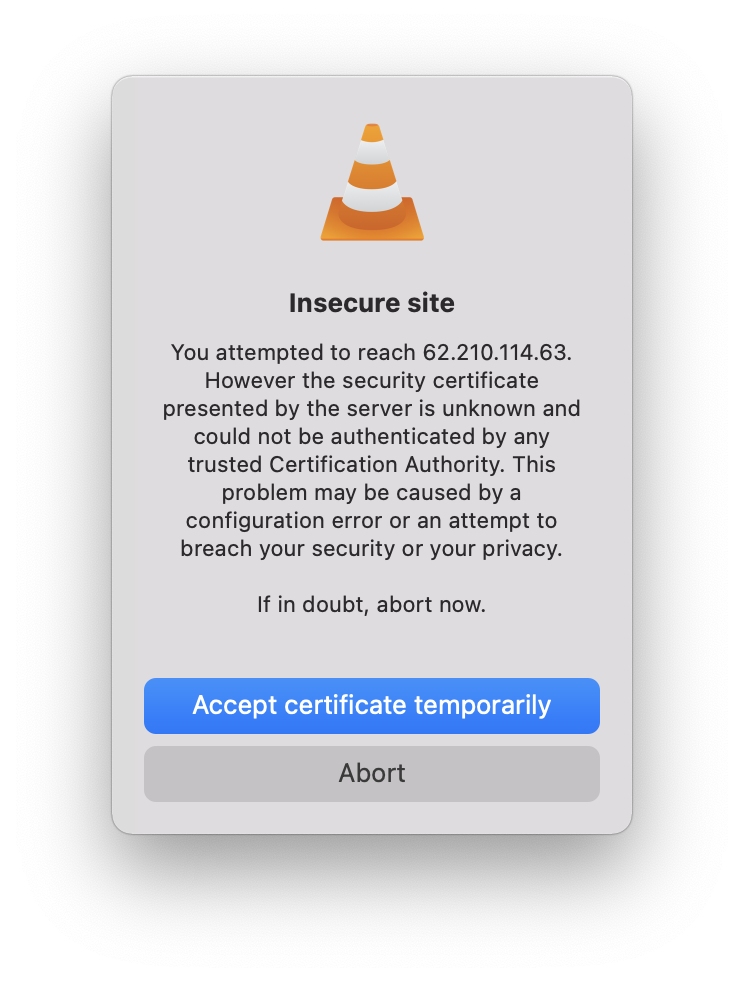

# psychedelik.com

	PSYCHEDELIK.COM | Streaming Psytrance since 2001

> [You are listening to `psyckedelik.com`, that is _psychedelic_ with a 'k'](psychedelik.mp3)

The web site used to be located at `psychedelik.com`, either via
[HTTP][http-website] or [HTTPS][https-website].
The stream server used to be located in `stream.psychedelik.com`, and hosted
the livestreams in a port starting with `8000`.

[http-website]: http://psychedelik.com/
[https-website]: https://psychedelik.com/

I gathered a list of the ports and the stream that is available on each one:

| Port   | URL                       | Stream      |
|:------:|:--------------------------|:------------|
| `8000` | http://62.210.114.63:8000 | psytrance
| `8002` | http://62.210.114.63:8002 | Ambient
| `8010` | http://62.210.114.63:8010 | Progressive
| `8014` | http://62.210.114.63:8014 | Dark
| `8030` | http://62.210.114.63:8030 | Drum N Bass
| `8032` | http://62.210.114.63:8032 | Mixes

You can also stream the music via HTTPS, but beware that the certificate
that is presented is not valid for the domain name / IP address.

|  |
|:------------------------------:|
| Warning presented by VLC due to a certificate validation error
